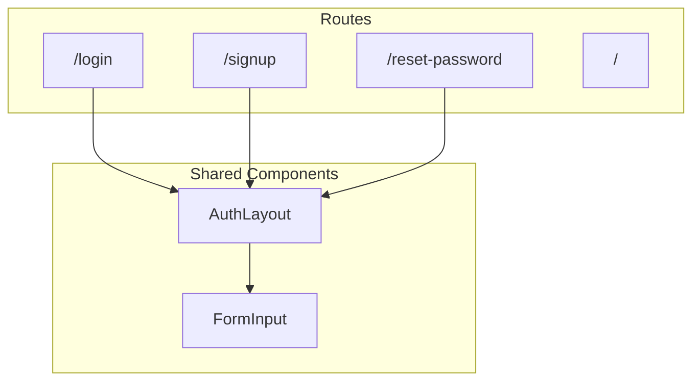

# Auth Pages Implementation Plan

## Overview

Build three authentication pages (Login, Sign Up, Password Reset) with React Router navigation and CSS Modules styling. The implementation will include form validation and a clean, modern UI ready for backend integration.

## Architecture



## File Structure

```
src/
├── pages/
│   └── auth/
│       ├── LoginPage.tsx
│       ├── LoginPage.module.css
│       ├── SignUpPage.tsx
│       ├── SignUpPage.module.css
│       ├── ResetPasswordPage.tsx
│       └── ResetPasswordPage.module.css
├── components/
│   └── auth/
│       ├── AuthLayout.tsx
│       ├── AuthLayout.module.css
│       ├── FormInput.tsx
│       └── FormInput.module.css
└── App.tsx (updated with routes)
```

## Implementation Steps

### 1. Install React Router

Add `react-router-dom` package for client-side routing.

### 2. Create Shared Auth Components

- **AuthLayout**: Wrapper component with centered card design, logo area, and consistent styling
- **FormInput**: Reusable input component with label, validation states, and error messages

### 3. Build Auth Pages

- **LoginPage**: Email/password fields, "Forgot password?" link, sign up link
- **SignUpPage**: Email, password, confirm password fields, login link
- **ResetPasswordPage**: Email field for password reset request, back to login link

### 4. Configure Routing

Update [src/App.tsx](src/App.tsx) to set up React Router with routes for `/login`, `/signup`, `/reset-password`, and redirect logic.

### 5. Form Validation

Add client-side validation for:

- Email format validation
- Password minimum length (8 characters)
- Password confirmation matching
- Required field checks

## Key Features

- Clean, pet-themed aesthetic with warm colors
- Responsive design for mobile and desktop
- Accessible form inputs with proper labels
- Visual feedback for validation errors
- Smooth transitions between auth states